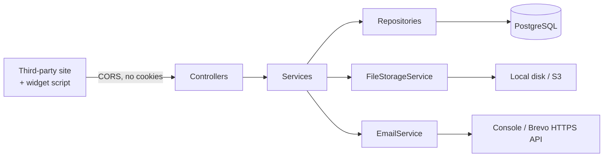

# GimmeComments — Server

**Comments as a service.** A website adds one script tag and gets a working comment box — threads, likes, moderation-ready — without building or hosting any of it.

**[Live demo](https://rohits1402.github.io/gimme-comments-server/)** · **[API documentation](https://gimme-comments-server-p7av.onrender.com/swagger-ui.html)**

*The demo page is a static file on GitHub Pages with no backend of its own. Everything on it is loaded cross-origin from the API. The API runs on a free instance that sleeps after inactivity, so the first request may take up to a minute.*


[](https://github.com/Rohits1402/gimme-comments-server/actions/workflows/ci.yml)

---

## What this is

This is a Spring Boot rewrite of a Node/Express service originally built in 2023. The old server is still the contract: same URLs, same JSON envelopes, same snake_case keys, so the existing React widget and admin panel work against this backend unchanged.

It is not a line-by-line translation. The port deliberately fixes a number of real defects in the original, including a response that embedded every commenter's bcrypt hash and live OTP in public comment listings. Every intentional difference is written down in **[PARITY-NOTES.md](PARITY-NOTES.md)** with the reasoning.

## Stack

| Concern | Choice |
|---|---|
| Language / runtime | Java 21 |
| Framework | Spring Boot 4.1.0, Spring MVC |
| Persistence | PostgreSQL 17 via Spring Data JPA and Hibernate, schema owned by Flyway (Docker for dev, Neon for prod) |
| Authentication | JWT (jjwt 0.12.6), bcrypt password hashing |
| File storage | Local disk in dev, AWS S3 in prod — one interface, two implementations |
| Email | Logged to console in dev, Brevo over HTTPS in prod |
| API documentation | springdoc-openapi 3.0.3 → Swagger UI |
| Tests | JUnit 6, Mockito, MockMvc slice tests |
| Build | Maven (wrapper included) |

## Quick start

Requires Docker. Nothing else — no JDK, no PostgreSQL installation.

```bash
git clone https://github.com/Rohits1402/gimme-comments-server.git
cd gimme-comments-server
docker compose up --build
```

That starts the application and a PostgreSQL alongside it on a private network, with a named volume so the database survives being restarted. The app listens on **8080**; PostgreSQL is published on **5433**, deliberately not 5432, so it cannot collide with a PostgreSQL you already have installed. Flyway builds the schema on first start, so there is nothing to import.

Then open **http://localhost:8080/swagger-ui.html** to browse and call every endpoint.

**Without Docker**, you need JDK 21 and a PostgreSQL 17 on `localhost:5433` holding a `gimmecomments_dev` database owned by `gimmecomments` with password `devpassword` — the same values `compose.yaml` uses:

```bash
./mvnw spring-boot:run
```

Either way the `dev` profile applies: files are written to `./uploads` and emails are printed to the console instead of sent.

## Configuration

The `dev` profile needs nothing. The `prod` profile reads every secret from the environment — none of them are in this repository, and none ever should be:

| Variable | Purpose |
|---|---|
| `SPRING_DATASOURCE_URL` | JDBC URL of the PostgreSQL database |
| `SPRING_DATASOURCE_USERNAME` | Database user |
| `SPRING_DATASOURCE_PASSWORD` | Database password |
| `JWT_SECRET` | Base64 signing key for tokens |
| `BREVO_API_KEY` | Brevo transactional email API key |
| `MAIL_FROM` | Sender address, verified in Brevo |
| `S3_BUCKET` | Bucket name for profile images |
| `AWS_ACCESS_KEY_ID` / `AWS_SECRET_ACCESS_KEY` | Read by the AWS SDK's default credential chain |

Email goes out over Brevo's HTTPS API rather than SMTP because the free hosting tier blocks outbound connections on the SMTP ports. An HTTP call on 443 is not subject to that restriction.

```bash
./mvnw spring-boot:run -Dspring-boot.run.profiles=prod
```

## API

Everything lives under `/api/v1`. Authentication is a bearer token: `Authorization: Bearer <token>`, obtained from `POST /api/v1/auth/login`.

| Area | Endpoints |
|---|---|
| Accounts | `register`, `login`, account verification by OTP, password reset by OTP |
| Profile | read, update details, change password, upload profile image, delete account |
| Websites | full CRUD, scoped to the owner |
| Comments | list, create (with threaded replies), edit, delete |
| Likes | add and remove |
| Widget | `GET /api/v1/initialization` plus the static bundle |

Reading comments is public — that is the point of an embeddable widget. Everything else requires a token.

The full specification is generated from the code and served at `/v3/api-docs`.

## Architecture



Requests pass through a filter chain that stamps a request id into the logging context, then reads and verifies the JWT. Controllers handle HTTP and shape responses; services own the rules; repositories talk to PostgreSQL through JPA. Exceptions are translated to the API's `{"msg": "..."}` error format in one place.

`FileStorageService` and `EmailService` are interfaces with a dev and a prod implementation selected by Spring profile, so the service layer never knows whether a file went to disk or to S3.

## Tests

```bash
./mvnw test
```

Controller slices using `@WebMvcTest` with mocked services, plus one full-context test that verifies every bean can be wired. They cover, among other things, that passwords never appear in a response, that a request without a token is rejected, that a caller's identity comes from the token rather than the request body, and that another user's data returns 404 rather than 403.

## Project layout

```
config/       security, JWT filter, CORS, logging, async, S3, OpenAPI
controller/   HTTP endpoints only
service/      business rules
repository/   Spring Data interfaces
model/jpa/    JPA entities
resources/db/migration/  Flyway migrations — append-only, never edited once applied
dto/          request and response records — entities are never returned directly
exception/    exception hierarchy and the global handler
```

## Licence

[MIT](LICENSE) — the Java source, configuration, tests, and documentation in this repository.

The compiled widget bundle under `src/main/resources/static/build/` is the front-end from the original 2023 project, which was built by a team. It is included here so the server can serve it, and its authorship is not solely mine.
