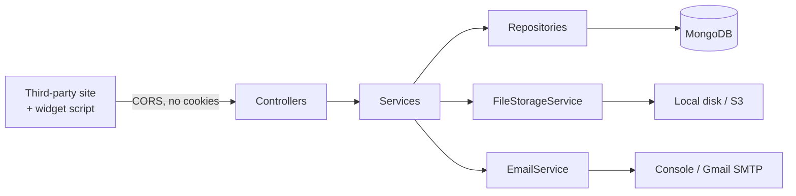

# GimmeComments — Server

**Comments as a service.** A website adds one script tag and gets a working comment box — threads, likes, moderation-ready — without building or hosting any of it.


[](https://github.com/Rohits1402/gimme-comments-server/actions/workflows/ci.yml)

---

## What this is

This is a Spring Boot rewrite of a Node/Express service originally built in 2023. The old server is still the contract: same URLs, same JSON envelopes, same snake_case keys, so the existing React widget and admin panel work against this backend unchanged.

It is not a line-by-line translation. The port deliberately fixes a number of real defects in the original, including a response that embedded every commenter's bcrypt hash and live OTP in public comment listings. Every intentional difference is written down in **[PARITY-NOTES.md](PARITY-NOTES.md)** with the reasoning.

## Stack

| Concern | Choice |
|---|---|
| Language / runtime | Java 21 |
| Framework | Spring Boot 4.1.0, Spring MVC |
| Persistence | MongoDB via Spring Data (local for dev, Atlas for prod) |
| Authentication | JWT (jjwt 0.12.6), bcrypt password hashing |
| File storage | Local disk in dev, AWS S3 in prod — one interface, two implementations |
| Email | Logged to console in dev, Gmail SMTP in prod |
| API documentation | springdoc-openapi 3.0.3 → Swagger UI |
| Tests | JUnit 6, Mockito, MockMvc slice tests |
| Build | Maven (wrapper included) |

## Quick start

Requires JDK 21 and a MongoDB running on `localhost:27017`.

```bash
git clone https://github.com/Rohits1402/gimme-comments-server.git
cd gimme-comments-server
./mvnw spring-boot:run
```

The application starts on port 8080 with the `dev` profile: local MongoDB, files written to `./uploads`, and emails printed to the console instead of sent.

Then open **http://localhost:8080/swagger-ui.html** to browse and call every endpoint.

## Configuration

The `dev` profile needs nothing. The `prod` profile reads every secret from the environment — none of them are in this repository, and none ever should be:

| Variable | Purpose |
|---|---|
| `MONGO_URI` | MongoDB Atlas connection string |
| `JWT_SECRET` | Base64 signing key for tokens |
| `MAIL_USERNAME` / `MAIL_PASSWORD` | Gmail SMTP account and app password |
| `S3_BUCKET` | Bucket name for profile images |
| `AWS_ACCESS_KEY_ID` / `AWS_SECRET_ACCESS_KEY` | Read by the AWS SDK's default credential chain |

```bash
./mvnw spring-boot:run -Dspring-boot.run.profiles=prod
```

## API

Everything lives under `/api/v1`. Authentication is a bearer token: `Authorization: Bearer <token>`, obtained from `POST /api/v1/auth/login`.

| Area | Endpoints |
|---|---|
| Accounts | `register`, `login`, account verification by OTP, password reset by OTP |
| Profile | read, update details, change password, upload profile image, delete account |
| Websites | full CRUD, scoped to the owner |
| Comments | list, create (with threaded replies), edit, delete |
| Likes | add and remove |
| Widget | `GET /api/v1/initialization` plus the static bundle |

Reading comments is public — that is the point of an embeddable widget. Everything else requires a token.

The full specification is generated from the code and served at `/v3/api-docs`.

## Architecture



Requests pass through a filter chain that stamps a request id into the logging context, then reads and verifies the JWT. Controllers handle HTTP and shape responses; services own the rules; repositories talk to MongoDB. Exceptions are translated to the API's `{"msg": "..."}` error format in one place.

`FileStorageService` and `EmailService` are interfaces with a dev and a prod implementation selected by Spring profile, so the service layer never knows whether a file went to disk or to S3.

## Tests

```bash
./mvnw test
```

Controller slices using `@WebMvcTest` with mocked services, plus one full-context test that verifies every bean can be wired. They cover, among other things, that passwords never appear in a response, that a request without a token is rejected, that a caller's identity comes from the token rather than the request body, and that another user's data returns 404 rather than 403.

## Project layout

```
config/       security, JWT filter, CORS, logging, async, S3, OpenAPI
controller/   HTTP endpoints only
service/      business rules
repository/   Spring Data interfaces
model/        MongoDB documents
dto/          request and response records — entities are never returned directly
exception/    exception hierarchy and the global handler
```

## Licence

[MIT](LICENSE) — the Java source, configuration, tests, and documentation in this repository.

The compiled widget bundle under `src/main/resources/static/build/` is the front-end from the original 2023 project, which was built by a team. It is included here so the server can serve it, and its authorship is not solely mine.
