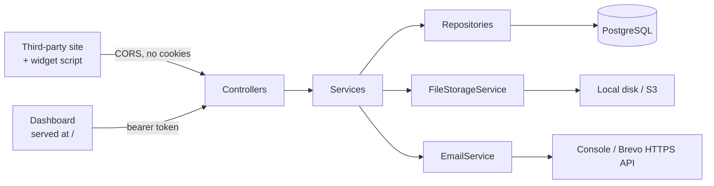

# GimmeComments — Server

**Comments as a service.** A website adds one script tag and gets a working comment box — threads, likes, moderation-ready — without building or hosting any of it.

**[Open the app](https://gimme-comments-server-p7av.onrender.com)** · **[See it on a real page](https://rohits1402.github.io/gimme-comments-server/)** · **[API documentation](https://gimme-comments-server-p7av.onrender.com/swagger-ui.html)**

*The second link is a static page on GitHub Pages with no backend of its own — it embeds the widget exactly as a customer's site would, cross-origin. The app runs on a free instance that sleeps after inactivity, so the first request may take up to a minute.*


[](https://github.com/Rohits1402/gimme-comments-server/actions/workflows/ci.yml)

---

## What this is

This is a Spring Boot rewrite of a Node/Express service originally built in 2023. The old server is still the contract: same URLs, same JSON envelopes, same snake_case keys.

The embeddable widget in `client/` was rewritten too. The 2023 bundle read MongoDB-era field names — `_id`, `createdAt`, and the commenter's email address — none of which this API sends, so "unchanged" was never quite true. What is preserved is the wire contract, not the front-end code.

It is not a line-by-line translation. The port deliberately fixes a number of real defects in the original, including a response that embedded every commenter's bcrypt hash and live OTP in public comment listings. Every intentional difference is written down in **[PARITY-NOTES.md](PARITY-NOTES.md)** with the reasoning.

## Stack

| Concern | Choice |
|---|---|
| Language / runtime | Java 21 |
| Framework | Spring Boot 4.1.0, Spring MVC |
| Persistence | PostgreSQL 17 via Spring Data JPA and Hibernate, schema owned by Flyway (Docker for dev, Neon for prod) |
| Authentication | Short-lived JWT access tokens (jjwt 0.12.6) plus rotating refresh tokens, bcrypt password hashing |
| File storage | Local disk in dev, AWS S3 in prod — one interface, two implementations |
| Email | Logged to console in dev, Brevo over HTTPS in prod |
| API documentation | springdoc-openapi 3.0.3 → Swagger UI |
| Tests | JUnit 6, Mockito, MockMvc slices, and Testcontainers 2.0.5 where a real PostgreSQL is the only honest test |
| Widget | React 19 + Vite, built to a single IIFE bundle, no runtime dependencies |
| Dashboard | React 19 + Vite, served by the application itself at `/` |
| Build | Maven (wrapper included); npm for the widget and the dashboard |

## Quick start

Requires Docker. Nothing else — no JDK, no PostgreSQL installation.

```bash
git clone https://github.com/Rohits1402/gimme-comments-server.git
cd gimme-comments-server
docker compose up --build
```

That starts the application and a PostgreSQL alongside it on a private network, with a named volume so the database survives being restarted. The app listens on **8080**; PostgreSQL is published on **5433**, deliberately not 5432, so it cannot collide with a PostgreSQL you already have installed. Flyway builds the schema on first start, so there is nothing to import.

Then open **http://localhost:8080/swagger-ui.html** to browse and call every endpoint.

**Without Docker**, you need JDK 21 and a PostgreSQL 17 on `localhost:5433` holding a `gimmecomments_dev` database owned by `gimmecomments` with password `devpassword` — the same values `compose.yaml` uses:

```bash
./mvnw spring-boot:run
```

Either way the `dev` profile applies: files are written to `./uploads` and emails are printed to the console instead of sent.

## Configuration

The `dev` profile needs nothing. The `prod` profile reads every secret from the environment — none of them are in this repository, and none ever should be:

| Variable | Purpose |
|---|---|
| `SPRING_DATASOURCE_URL` | JDBC URL of the PostgreSQL database |
| `SPRING_DATASOURCE_USERNAME` | Database user |
| `SPRING_DATASOURCE_PASSWORD` | Database password |
| `JWT_SECRET` | Base64 signing key for tokens |
| `BREVO_API_KEY` | Brevo transactional email API key |
| `MAIL_FROM` | Sender address, verified in Brevo |
| `S3_BUCKET` | Bucket name for profile images |
| `AWS_ACCESS_KEY_ID` / `AWS_SECRET_ACCESS_KEY` | Read by the AWS SDK's default credential chain |

Email goes out over Brevo's HTTPS API rather than SMTP because the free hosting tier blocks outbound connections on the SMTP ports. An HTTP call on 443 is not subject to that restriction.

```bash
./mvnw spring-boot:run -Dspring-boot.run.profiles=prod
```

## API

Everything lives under `/api/v1`. Authentication is a bearer token: `Authorization: Bearer <token>`, obtained from `POST /api/v1/auth/login`.

| Area | Endpoints |
|---|---|
| Accounts | `register`, `login`, account verification by OTP, password reset by OTP |
| Profile | read, update details, change password, upload profile image, delete account |
| Websites | full CRUD, scoped to the owner |
| Comments | list (cursor-paged, a whole thread at a time), create (with threaded replies), edit, delete |
| Likes | add and remove |
| Overview | totals, fourteen days of activity and the newest comments across every website the caller owns, in one request |
| Widget | `GET /api/v1/initialization` plus the static bundle |

Reading comments is public — that is the point of an embeddable widget. Everything else requires a token.

**A session can be taken back.** A JWT is verified by checking a signature, not by looking anything up, so nothing done to the database stops one working. The access token is therefore short-lived, and a separate refresh token — stored only as a hash, single-use — is exchanged at `POST /api/v1/auth/refresh` for a new pair. Presenting a refresh token that has already been spent means a copy of it is loose, so the entire session family is revoked. Signing out ends one session rather than every device.

**The public endpoints are rate limited:** ten requests a minute per IP across the account endpoints, and three codes per ten minutes per email address on OTP generation. Those endpoints need no token and one of them sends real email.

The full specification is generated from the code and served at `/v3/api-docs`.

## Architecture



Requests pass through a filter chain that stamps a request id into the logging context, then reads and verifies the JWT. Controllers handle HTTP and shape responses; services own the rules; repositories talk to PostgreSQL through JPA. Exceptions are translated to the API's `{"msg": "..."}` error format in one place.

`FileStorageService` and `EmailService` are interfaces with a dev and a prod implementation selected by Spring profile, so the service layer never knows whether a file went to disk or to S3.

## Tests

```bash
./mvnw test
```

The suite is in two halves, and the split is deliberate.

**Controller slices** (`@WebMvcTest`, services mocked) cover what HTTP is responsible for: that passwords never appear in a response, that a request without a token is rejected with 401, that a caller's identity comes from the token rather than the request body, and that another user's data returns 404 rather than 403.

**Service tests against a real PostgreSQL**, started by Testcontainers, cover everything a mock cannot prove. A mocked repository returns whatever the test told it to, so it can demonstrate nothing about a unique constraint, a cursor comparison, a `LIMIT`, a cascade, or the order a transaction commits in. These tests cover paging, the duplicate-like race, constraint names, the rule that side effects wait for the commit, the `V6` backfill, and refresh-token rotation and reuse detection.

One full-context test verifies every bean can still be wired. Docker must be running for the Testcontainers half; nothing else is needed, and no test touches the development database.

## Project layout

```
config/       security, JWT filter, CORS, logging, async, S3, OpenAPI
controller/   HTTP endpoints only
service/      business rules
repository/   Spring Data JPA interfaces
model/        JPA entities and enums
dto/          request and response records — entities are never returned directly
exception/    exception hierarchy and the global handler

client/                            the embeddable widget (React + Vite)
dashboard/                         the signed-in dashboard (React + Vite), built into static/app
docs/                              the GitHub Pages demo — a plain page that embeds the widget

src/main/resources/db/migration/   Flyway migrations — append-only, never edited once applied
src/test/                          controller slices, and service tests against a real PostgreSQL
```

## Licence

[MIT](LICENSE) — everything in this repository: the Java source, the widget in `client/`, the dashboard in `dashboard/`, configuration, tests, and documentation.

The widget was rewritten from scratch in August 2026. Until then this repository shipped the compiled front-end from the original 2023 project, which was built by a team and was not solely my work; that bundle has been removed. `client/` replaces it and is mine.
